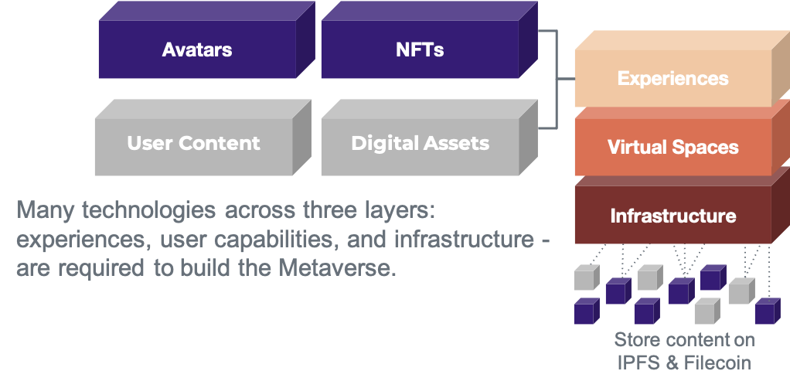

# Community-Driven Technical Capability Framework

### Novel 4-layer framework

The metaverse landscape is structured along a 4-layer framework. It groups projects by type and technologies based on experiences, user capabilities and infrastructure. Each technology layer is split up into various components that are required to build Metaverse applications (mApps).

The framework will evolve over time together with the landscape.

mscape.io - Community-driven metaverse landscape
https://mscape.io/

### The Filecoin Stack

The Filecoin stack allows storage and retrieval of the most important data. It is a set of modular components to build an open, composable Metaverse. The modularity provides flexibility for teams to pick and choose the components they need.

* NFT.storage is designed for NFT developers who want free, multi-generational, decentralized storage on IPFS and Filecoin.https://nft.storage/
* Web3.Storage is a general-purpose Filecoin & IPFS storage service with familiar and simple interfaces offering production-level storage and retrieval that is reliable and performant. https://web3.storage/
* Estuary is an open source software that allows the easy sending of public data to the Filecoin network, which can be retrieved from anywhere. http://estuary.tech/
* Filecoin, built on top of IPFS, is the world’s *largest* distributed storage network powered by robust crypto-economic incentives, and enforced via zero knowledge proofs. Filecoin guarantees data persistence, and complements IPFS. https://filecoin.io/
* IPFS is a distributed system for storing and accessing files, data assets, applications, and data. IPFS knows how to find what you ask for, by using its content address rather than its location - regardless of where the content is stored. Ideal for quick and secure data retrieval. https://ipfs.io/
* IPLD: A data model of the content-addressable web - allowing us to treat all hash-linked data structures as subsets of a unified information space. IPLD enables verifiable linking, regardless of where content ultimately resides. It is a core building block for an interoperable Metaverse.https://ipld.io/
* Libp2p: A modular system of *protocols, specifications, and libraries* that enable the development of peer-to-peer network applications. Trusted by [Polkadot](https://www.parity.io/blog/why-libp2p) and [Ethereum 2.0](https://github.com/ethereum/consensus-specs/blob/dev/specs/phase0/p2p-interface.md#why-are-we-overriding-the-default-libp2p-pubsub-message-id). https://libp2p.io/

### Immortalize your data on Filecoin

Many technologies across three layers: experiences, user capabilities, and infrastructure - are required to build the Metaverse.

