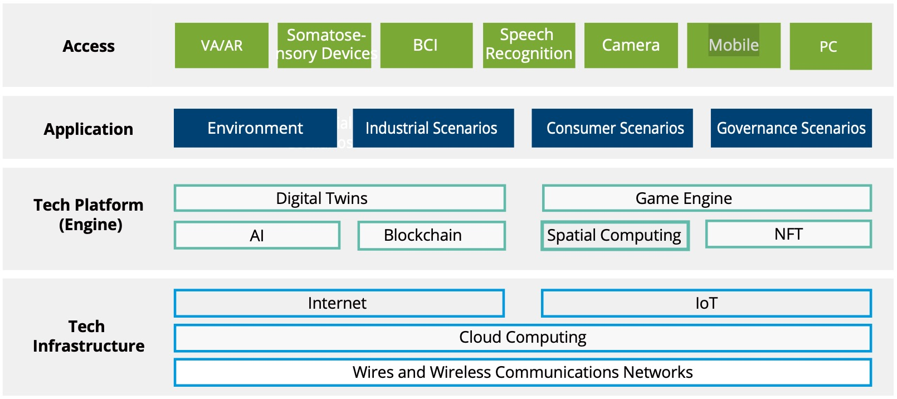
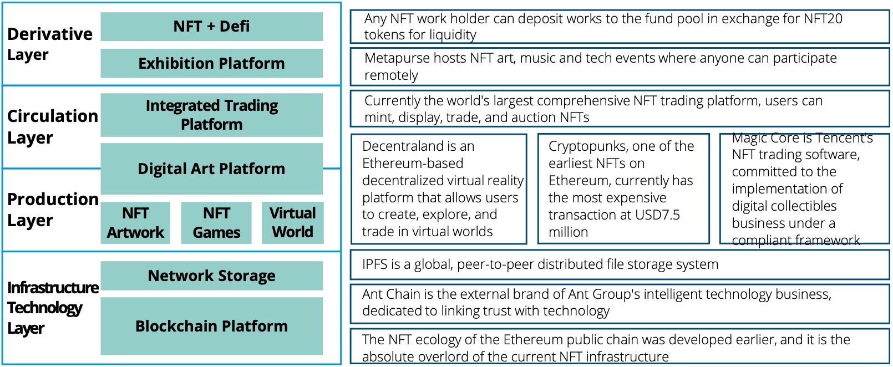

# The Metaverse Industry Landscape

## The Metaverse Industry Framework

There are numerous enterprises already involved in Metaverse. Our framework for the Metaverse industry below facilitates analysis of the sector, related companies, and different business applications.

Given the broad contents in and different understandings of the Metaverse, a unified industry framework is critical for analyzing the industry, developing solutions, and other Metaverse-related work in a structured way.

We view the Metaverse as a large enterprise application with four layers:

**Access layer:** VR/AR, somatosensory devices, brain-computer interfaces, and other technologies that connect users to the Metaverse.

**Application layer:** Generates all digital contents and applications, including environment building, industrial manufacturing applications, games, social activities, digital artworks, economic activity, and virtual offices.

**Technology platform layer:** Contains technologies that support virtual community building, community rules and application development, including the generation and import of virtual infrastructures such as blocks and architectures; supporting technologies such as game engines and content

distribution platforms; and AI algorithms that support intelligent applications and interaction.

**Technology infrastructure layer:**

The underlying technologies of the Metaverse including internet, IoT, 5G/6G, and cloud computing.

We use this industry framework to compare different participants in
 the Metaverse. People wanting to enter the Metaverse or investors and companies can use this to identify specific opportunities in the Metaverse industry.

## **The NFT industry chain**

NFTs are one of the fastest-growing arenas of the Metaverse, catering to people's curiosity, pursuit of artistic creativity, and investment demand for digital art collections. The NFT industry chain has four layers: infrastructure, production, circulation, and derivatives.

**The infrastructure technology layer** is mainly composed of blockchain (public chains, side chains, developer tools, token standards, wallets, and payments) and network- attached storage. The infrastructure layer creates and captures the value of the NFT value chain through NFT minting. For example, the gas fee during minting goes to the blockchain, and the more NFTs minted, the higher the value captured by the blockchain.

Public chains are independent, community-oriented blockchains
 like Ethereum and Flow Blockchain. Ethereum, with its long history, is the leading blockchain in the NFT market. Sidechains are new blockchains created to alleviate high traffic, improve public chain performance, and realize certain functions that some public chains cannot fulfill. Protocol standards create an underlying logic and consensus during NFT minting and include ERC20, ERC721, and ERC1155. Developer tools help develop blockchain applications.

Network storage is data storage on a blockchain, represented by InterPlanetary File System IPFS distributed storage. A wallet, e.g. Tokenall, is a tool for private key storage without holding tokens.

**The production and circulation layers** host platforms that produce and trade NFT works. Production platforms have two usual models, UGC and PGC, to create NFT artworks, games, virtual worlds,
 and marketplaces. For example, Decentraland is a decentralized virtual world based on Ethereum. Users of Decentraland can create, explore, and trade NFT works in this virtual world. Sandbox launched its blockchain-based Play-to-Earn game in 2018, which has no storyline or settled ending but allows players to

experience the game and acquire digital assets that are tradable in the blockchain.

The Huanhe NFT marketplace in China belongs to Tencent, which is devoted to developing digital collection business that confirms with compliance requirements. Cryptopunks was one

of the earliest NFT collections on Ethereum, where the most expensive trade reached USD7.5 million. OpenSea is the world's largest comprehensive NFT marketplace, where users can mint, display, trade, and auction NFTs.

**The derivative layer** includes exhibition platforms and combinations of NFT applications with other industries.

This layer includes NFT fund Metapurse, a cryptocurrency fund created and funded by Metakovan and operated with Twobadour. It focuses on identifying early-stage projects across blockchain infrastructure,

finance, artwork, collectibles, and virtual real estate, and creates virtual museums, art exhibitions, music, and technology events.

Decentralized finance or DeFi is one example of a combination of NFTs and finance. It empowers traders to save, borrow, transact, and buy insurance without a centralized entity (bank or financial institution) and overhaul the traditional banking system.

Liquidity has often limited the financialization and popularization of digital art. NFT20 is a decentralized NFT derivatives trading market and protocol that addresses this issue
 by allowing NFT producers to create liquidity pools for their projects and traders to benefit from those pools' greater liquidity and fair prices. Its trading volume and liquidity ensure fair prices for all. NFT20 tokens can also be bought as an investment.

## Major platform players

Platform-based players (mainly large internet and technology companies), rely on their mature technologies, broad user bases, and existing application scenarios to quickly deploy Metaverse applications. Benefiting from capital advantages, they can expand their Metaverse reach through investment or M&A in areas not yet covered by their own businesses. This section analyzes these industry giants and provides an overview of their Metaverse layouts.

### Meta

Meta has one of the most comprehensive layouts in Metaverse. It has dabbled in hardware, software, content, digital currency and other

segments of the Metaverse through strategy and transformation. Meta has launched several programming tools including Spark AR, Presence Platform, and Pytorch to build and develop the Metaverse community.

In the access layer, Meta's Oculus leads the global market for XR devices, with its latest product, Oculus Quest 2, taking up to 75% of the market. In content, Meta has acquired several VR game and cloud game developers and launched virtual social and
 office platforms like Horizon Worlds and Horizon Workrooms. In digital currency, it has Libra and is now marketing the Diem token. In the platform layer, Meta has released the Presence Platform covering a series

of machine cognition and AI functions that include Insight SDK, Interaction SDK, Voice SDK, Tracked Keyboard SDK, and other components, and
 plans to build an ecosystem that supports Metaverse learning. In the network layer, Meta has launched open infrastructure and data center network hardware that supports cloud services and is growing in areas like AI.

### Microsoft

Microsoft is devoted to all four layers and helps enterprise customers with digital transformation through a series of products including HoloLens, Mesh, Cloud, and Azure Digital Twins. Unlike Meta, which emphasizes the consumer end (household applications, office, social apps, and UGC content); Microsoft puts more efforts into the enterprise Metaverse.

In August 2021, Microsoft announced its enterprise Metaverse solution, with two core features: Dynamics 365 Connected Spaces and Mesh for Teams. Dynamics 365 Connected Spaces helps company administrators analyze the movements and interactions of consumers in grocery stores or employees on factory floors. Mesh for Microsoft Teams integrates Microsoft Mesh (an MR meeting platform) into Microsoft Teams, allowing people in different locations to collaborate on Teams using 3D avatars. In the hardware layer, Microsoft has VR/AR visualization (the Hololens series) and somatosensory technology (Kinect). In terms of applications, apart from enterprise software mentioned above, Microsoft has acquired Minecraft and Activision Blizzard in gaming. As the second-largest public cloud server in the world, Microsoft is experienced in edge computing and AI.

### Google

Google has solid foundation in the infrastructure layer of the Metaverse through its AI and cloud service. In 2017, Google's strategy changed from Mobile First to AI First, and it now leads the AI industry in R&D and applications.

Tensor Flow, Google's open-source software for AI, is widely used worldwide, and Google has launched TPU chips specifically for Tensor Flow. In cloud computing, Google Cloud

is among the world's top four public cloud service providers. With its combined efforts in cloud computing and AI, Google can play an important role in Metaverse infrastructure. In the access layer, it does not yet have a top product but the release of Google

Glass in 2012 should not be ignored. Google has only a few deployments
 in the application layer, and mainly combines existing businesses with the Metaverse concept, including Stadia in cloud games and YouTube VR in software services.

### Amazon

Amazon's Metaverse strategy of is mainly based on its current cloud computing AWS and e-commerce business.

It has provided cloud-computing services to help Meta accelerate R&D on its AI projects. The two companies will also cooperate to help customers improve the performance of PyTorch (a deep learning computing framework) on AWS, and accelerate the modelling, training, and deployment in AI and machine learning.

Amazon also cooperates with Epic games and provides it with cloud- computing services. Epic Games' ace product, Fortnite, has 350 million users worldwide. As a Metaverse game, it requires massive computing resources. Almost all of its workload is currently on AWS. In addition, Amazon is using its advantages in retail to develop AR shopping applications.

## Further Reading

[The Web 3 Toolbox - Outlier Ventures](https://outlierventures.io/research/the-web-3-toolbox/)

[The Tools of the Metaverse. NewZoo launched their new, free 73-page… | by Theo Priestley | Medium](https://medium.com/@theo/the-tools-of-the-metaverse-a9c7e90fe020)

[Newzoo Metaverse Report](https://resources.newzoo.com/hubfs/Reports/Free_Metaverse_Report_Newzoo.pdf)

[The Metaverse Toolkit: Essential Hardware and Software](https://accelerationeconomy.com/metaverse/the-metaverse-toolkit-essential-hardware-software/)

[Welcome_to_the_metaverse_- A toolkit for the next 24 months ](https://assets.ctfassets.net/77i4pkf08zk1/1dKuMwk68OBBK0H9wBEUtB/de1f0da81bfebd2c1e87b111f1d55a6e/Welcome_to_the_metaverse_.pdf）

[Why the Internet needs the IPFS](https://spectrum.ieee.org/peer-to-peer-network)

[Blockchain Middleware](https://metisdao.medium.com/blockchain-middleware-ccb41ded0fab)

[The Web3 Developer Stack](https://www.coinbase.com/blog/a-simple-guide-to-the-web3-developer-stack)

https://twitter.com/jonathankingvc/status/1565344771501019136

https://www.coinbase.com/blog/a-simple-guide-to-the-web3-stack

[Microsoft Metaverse vs. Facebook Metaverse: What’s the difference? – (blockchain-council.org)](https://www.blockchain-council.org/metaverse/microsoft-metaverse-vs-facebook-metaverse/)

[Microsoft Partners With Meta to Bring Teams, Microsoft 365, and Other Apps to Meta Quest Devices | Spiceworks 1](https://www.spiceworks.com/tech/it-strategy/news/microsoft-meta-partnership/)

[Microsoft vs. Meta: Who’s got the upper hand in the Metaverse? (fastcompany.com)](https://www.fastcompany.com/90777904/microsoft-vs-meta-whos-got-the-upper-hand-in-the-metaverse)

[Top Seven Companies Developing the Metaverse in 2022 – Inside Telecom – Inside Telecom](https://insidetelecom.com/top-seven-companies-developing-the-metaverse-in-2022/)

[What is Microsoft? (techtarget.com)](https://www.techtarget.com/searchwindowsserver/definition/Microsoft)

[Microsoft metaverse vs. Facebook metaverse: What’s the difference? (cointelegraph.com)](https://cointelegraph.com/metaverse-for-beginners/microsoft-metaverse-vs-facebook-metaverse-what-is-the-difference)

[Microsoft or Meta: Who’s best positioned to win the Metaverse? | Windows Central](https://www.windowscentral.com/microsoft-or-meta-whos-best-positioned-win-metaverse)

[Microsoft and Meta partnership brings Office 365 apps to the Metaverse (cointelegraph.com)](https://cointelegraph.com/news/microsoft-and-meta-partnership-brings-office-365-apps-to-the-metaverse#:~:text=Meta Platforms has partnered with,Connect 2022 keynote on Oct.)

[Microsoft and Meta partner to deliver immersive experiences for the future of work and play – The Official Microsoft Blog](https://blogs.microsoft.com/blog/2022/10/11/microsoft-and-meta-partner-to-deliver-immersive-experiences-for-the-future-of-work-and-play/)

[Metaverse Devices; The Best Gear To Enter the Metaverse (metamandrill.com)](https://metamandrill.com/metaverse-devices/)

[Microsoft joins ‘Metaverse’ club, gears for early 2022 launch; check out details – BusinessToday](https://www.businesstoday.in/technology/news/story/microsoft-joins-metaverse-club-gears-for-early-2022-launch-check-out-details-311207-2021-11-03)

[Microsoft, Meta brings Windows, Teams, Office, and Xbox to Quest VR headsets – Times of India (indiatimes.com)](https://timesofindia.indiatimes.com/gadgets-news/microsoft-meta-brings-windows-teams-office-and-xbox-to-quest-vr-headsets/articleshow/94810564.cms)

[The Metaverse is coming. Here are the cornerstones for securing it. – The Official Microsoft Blog](https://blogs.microsoft.com/blog/2022/03/28/the-metaverse-is-coming-here-are-the-cornerstones-for-securing-it/)

[Microsoft Stock: Defining Its Future With Gaming, Metaverse & Cloud | Seeking Alpha](https://seekingalpha.com/article/4481716-microsoft-q2-earnings-gaming-metaverse-cloud-future)

[Microsoft Is Hitting Home Runs, With The Metaverse On Deck | The Motley Fool](https://www.fool.com/investing/2022/01/10/microsoft-is-hitting-home-runs-with-the-metaverse/)

[Converging the physical and digital with digital twins, mixed reality, and metaverse apps | Blog e aggiornamenti di Azure | Microsoft Azure](https://azure.microsoft.com/it-it/blog/converging-the-physical-and-digital-with-digital-twins-mixed-reality-and-metaverse-apps/)

[Microsoft Metaverse; Learn About Microsoft’s Metaverse Strategy (metamandrill.com)](https://metamandrill.com/microsoft-metaverse/)

[The Microsoft Metaverse Is Officially Coming In 2022 | IS News (influentialsoftware.com)](https://www.influentialsoftware.com/microsoft-metaverse-is-coming/#:~:text=The Microsoft metaverse is coming to Microsoft Teams in early,to communicate in mixed reality.)

[How Web3 Founders Can Get the Most Out of an Accelerator Program](https://www.entrepreneur.com/science-technology/how-web3-founders-can-get-the-most-out-of-an-accelerator/442307)

[Trust and risk considerations for the metaverse: PwC](https://www.pwc.com/us/en/tech-effect/emerging-tech/metaverse-trust-and-risk-considerations.html)

[Market Map of the Metaverse. In my article on the value-chain of the… | by Jon Radoff | Building the Metaverse | Medium](https://medium.com/building-the-metaverse/market-map-of-the-metaverse-8ae0cde89696)

https://a16zcrypto.com/metaverse-real-estate-digital-land-value-to-users/

https://grayscale.com/wp-content/uploads/2021/12/Grayscale-Decentraland.pdf
