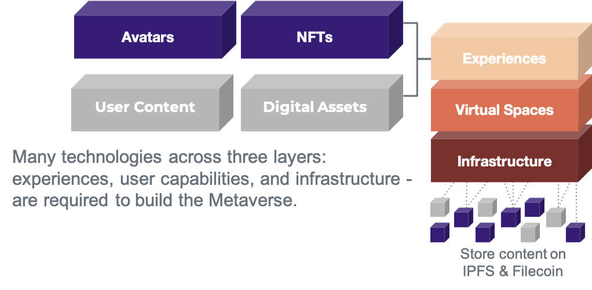

# The Web 3 Toolbox

https://outlierventures.io/research/the-web-3-toolbox/

The Tools of the Metaverse. NewZoo launched their new, free 73-page… | by Theo Priestley | Medium
https://medium.com/@theo/the-tools-of-the-metaverse-a9c7e90fe020

Newzoo Metaverse Report
https://resources.newzoo.com/hubfs/Reports/Free_Metaverse_Report_Newzoo.pdf

The Metaverse Toolkit: Essential Hardware and Software
https://accelerationeconomy.com/metaverse/the-metaverse-toolkit-essential-hardware-software/

Welcome_to_the_metaverse_- A toolkit for the next 24 months 
https://assets.ctfassets.net/77i4pkf08zk1/1dKuMwk68OBBK0H9wBEUtB/de1f0da81bfebd2c1e87b111f1d55a6e/Welcome_to_the_metaverse_.pdf

## **Web3 & Metaverse: Where do they fit each other?**

Many of us might be confused about how Metaverse and [Web 3.0](https://www.queppelin.com/what-is-web-3/) are related. The answer to this is simple. 

Metaverse is a platform where content is created and consumed. Anyone can create content for anyone. On the other hand, Web3 is an iteration or version of the web that will infuse decentralization into the Metaverse. Hence, when creators create content in the Metaverse, they can monetize it at their convenience.

Further, Web 3 allows users of the Metaverse to own their data and have full control over its utilization.

There are three major components of Web 3 (the next version of web) –

**Blockchain**

It is a distributed ledger system that offers immutable protection to the data stored in it. It is highly reliable, robust, and near-impossible to tamper with. With blockchain, users can store their data with complete protection.

**Digital assets**

These assets are issued on a blockchain. They are used to represent value, portability, ownership, and permanence. This facilitates the exchange of value between Metaverse dwellers without intermediation.

**Smart contracts**

They are self-executing protocols that contain conditional programming code. Once the pre-defined conditions are met, they get executed automatically. This introduces automation to all the processes across the board.

Web 3 consists of several principles, protocols and standards which could be said to form a stack that will inform and can and is being leveraged by the entrepreneurs and architects in The Metaverse.

In combination these technologies can be seen as a highly composable **Web3 Toolbox** for The Open Metaverse, where they are one and the same thing.

The Web 3 Toolbox brings a number of core innovations and building blocks, located in the middle of the diagram:

**Internet Money:** Bitcoin introduced a form of internet money and since then has served as a hedge to deflation, and increasingly for institutions as a treasury instrument, in fiat based systems due to loose monetary policies after a series of negative economic events and a gateway for many into a new virtual economy (at the time of writing estimated at 1 trillion USD in market capitalisation)

**Decentralised Finance (DeFi):** Ethereum extended Internet Money through the introduction of smart contracts to allow for stablecoins, that is virtual currencies which unlike Bitcoin are designed to be stable rather than a speculative asset. The generic programmability has allowed for an explosion in open, decentralised financial instruments often referred to as DeFi. These include borrowing and lending without the need for banks, as well as more sophisticated instruments such as options and decentralized exchanges, and some entirely novel structures, such as automated market makers. This has formed a proto-capital-market, at the time of writing estimated at $25 billion in total value locked.

**Sovereign Virtual Goods:** Bitcoin introduced digital scarcity for a fungible asset (“internet money”), where each token is interchangeable for another. Similarly, digital scarcity for unique assets has been realised through NFTs (Non Fungible Tokens). Here, unlike with a currency, the underlying assets are not interchangeable but unique in some way. The innovation in this area has concentrated on Ethereum, and as the result of a handful of simple standards for NFTs and their metadata there has been an explosion of innovation initially in a creator economy context of; art, music, tickets, virtual land, collectibles and gaming items. Whilst not new, their mainstreaming began late 2020 and have proven to be a powerful mechanism for the world builders and content creators of the Open Metaverse. They act as a gateway through digital consumption & play that will suck in the masses of users primarily because any activity in the open metaverse can be gamified and rewarded with NFTs, which can in turn have value on the open market. Virtual goods are ultimately easier to sell than physical goods, and will have significant and increasing value. Core technologies and entities around NFTs include minting houses, which facilitate the initial creation of the goods, marketplaces, which similar to real-world auction houses enable price discovery and trading.

**Digital to Physical redemption:** beyond purely digital sovereign virtual assets, new specialised protocols like Boson Protocol solve the digital to physical redemption problem, by representing physical items as NFTs which can be redeemed in the real world without the need for intermediaries. Enabling decentralized autonomous commerce across the metaverse blurring the distinction between virtual and physical.

**Decentralized governance:** as a result of both the necessity for governing the growing landscape of decentralized technologies and networks and the ideals of its community, a class of tools and concepts for decentralized governance has emerged. The concept of a Distributed Autonomous Organization (DAO) enables individuals and entities to form groups, jointly own assets, make decisions and participate in the economics of the DAO. Several mature building blocks for DAOs have emerged, including Aragon and DAOStack. They include and extend to tools like voting structures, and multisignature wallets for joint custody of assets. On the level of protocols, mechanisms for staking and slashing have emerged to incentivise participants in these open networks to behave benevolently. The Open Metaverse can benefit from insights and tools from decentralized governance both for governing metaverse platforms and their components, and enabling economic participation in each, as well as for people to organize themselves within it, such as with gamer guilds or clans.

**Distributed Compute & Storage aka Cloud 2.0:** The idea that The Cloud of distributed storage and compute could also be decentralised by specialised protocols like Filecoin or CUDOs, so not reliant on or giving any advantage to anyone company for example Amazon, Google or Microsoft which control 66% of the market. It almost means people that invest in expensive hardware to access the metaverse and increase performance can offset some of the cost by renting out capacity and in turn earning crypto-currencies and joining the virtual economy. It is also believed at a certain scale, and density in a given physical locale, it could increase the proximity of physical hardware to The Cloud at any given time as we unlock the bandwidth and compute of neighbouring connections, and therefore allow greater ‘edge computing’ for Metaverse ubiquity.

**Self Sovereign Identity & Verifiable Claims:** For a truly Open Metaverse, it is crucially important for people to have security of an online identity which they can protect and accumulate value with. Sovereignty and by consequence self custody of what the user owns are core principles to Web 3. However for what is called a true SSI (Self Sovereign Identity), we need dedicated protocols solely for the preservation of privacy of identity itself vs being public and on-chain when identity and its data is treated as just another digital asset. Innovations in Self Sovereign Identity and Verifiable Claims specifically mean we can identify ourselves, transact and prove things about ourselves (attest) without revealing the underlying or associated data. This is critical to avoid the role of a government or platform as the sole arbiters of our online identities, deplatforming or even state violence. And being applied to gaming and the metaverse by teams such as Crucible.

People, organizations and machines access these capabilities directly through wallets and applications, and by delegation through automated agents, always following the principles of sovereignty and self custody:

**Self Custody – Wallets and Applications:** The self custody of digital assets and wealth through user-controlled private keys and open source wallet software (free of any platform form of censorship and control) is foundational to crypto and as a consequence the Open Metaverse. This is sometimes referred to as sovereign wealth. The infrastructure was initially purely for the administration of crypto-currencies but is now being used for the management of other digital assets like data and NFTs (Non-Fungible Tokens).

**Agent based Web:** Computer programs with economic agency or autonomous agents that live and transact on blockchains to carry out increasingly complex automatic programs, such as AEAs (Autonomous Economic Agents) via Fetch.ai.

Outlier Ventures has been investing and accelerating the Web 3 ecosystem since 2013. In 2019 we launched Base Camp – an accelerator program for pre-seed startups operating in DeFi, NFTs and open data. We provide capital, help with your token design, access to our network of the best investors and founders of Web 3, back office support and mentorship.

What is more, in 2020 we started a decicated token launch program called Ascent where we help you launch, accelerate and scale your network.

## Why the Internet needs the IPFS

TODO: https://spectrum.ieee.org/peer-to-peer-network

## The Web3 Developer Stack

https://www.coinbase.com/blog/a-simple-guide-to-the-web3-developer-stack

https://twitter.com/jonathankingvc/status/1565344771501019136

https://www.coinbase.com/blog/a-simple-guide-to-the-web3-stack

In this edition of Around The Block, we’ll explore the growing web3 developer stack.

### The Web3 Developer Stack

### Building in Web2 vs Web3

Software development is the process of building computer programs. There are three main components to a given program:

1. The front-end (what users interact with)
2. The back-end (what users don’t see)
3. Database (where critical data is stored)

The front-end that a typical user interacts with through a mobile or desktop browser is basically the same in web2 and web3. A web3 app like Uniswap looks similar to a typical web2 app because both front-ends are mostly created using React — a popular developer framework for web and mobile apps.

It’s under the hood where web2 and web3 differ. The backend frameworks and *types* of databases that make web3’s defining characteristic — user-defined **ownership —** possible are new and unique.

Where web2 applications largely rely on centralized databases, web3 applications are built on decentralized databases (blockchains). This requires entirely new backends and new primitives like wallets.

The tools that aid in the creation, deployment, and maintenance of web2 applications are incredibly developer-friendly, thanks to decades of cumulative development. Out of the box solutions, mature infrastructure, shared code libraries, and easy to use frameworks largely make building in web2 a breeze.

Web3 on the other hand still requires specialized expertise to interface with complex infrastructure and commonly involves many redundant processes given that the stack is less developed, leaving teams to have to reinvent the wheel. That said, the tooling that will help onboard the next 1M+ web3 developers is rapidly improving.

Let’s take a (non-exhaustive) look at the evolving Web3 developer stack layer by layer (* denotes Coinbase Ventures portfolio company).

## Protocol layer

The first decision a web3 developer has to make is *which* blockchain protocol to build on. Building on Bitcoin is entirely different from building on Ethereum, and Solana differs from Ethereum, etc.

For faster and lower-cost applications, developers might want to build on a layer2 protocol — [Optimism](https://www.optimism.io/)*, [Arbitrum](https://bridge.arbitrum.io/)*, etc. For applications that need to port value from one chain to another, developers will want to leverage cross-chain bridges like [Hop*](https://hop.exchange/) or [Synapse](https://synapse.network/)*.

Once these decisions are made, developers can start to incorporate building blocks that make user applications possible.

## Infrastructure primitives

The next thing a developer needs to figure out is *how* their application will ultimately interact with the underlying blockchains. This is where infrastructure primitives come into play.

***Node infrastructure —\*** Nodes are where an app’s interaction with a blockchain “happens.” They’re computers that read the state of the blockchain and write updates to it once a user interacts with an application. Node infrastructure providers like [Coinbase Cloud](https://www.coinbase.com/cloud), [Infura](https://infura.io/)*, and [Alchemy](https://www.alchemy.com/)* let developers easily set-up, manage, or access blockchain nodes, saving developers considerable time and resources.

***Wallet & Key Management —\*** Blockchain wallets, like [Coinbase Wallet](https://www.coinbase.com/wallet), allow users to manage the private keys needed to perform transactions within web3 applications. Wallet and key management providers like [Web3Auth](https://web3auth.io/)* or [Pine Street Labs](https://www.pinestreetlabs.com/)*, enable developers to build secure connectivity between blockchain wallets and user-facing applications.

**Identity** — protocols like [ENS](https://ens.domains/)* serve as a user’s identity across applications. [Spruce](https://www.spruceid.com/)* provides frameworks and toolkits that developers can use to verify user credentials to authenticate actions on Ethereum. For example, developers can use the Spruce ID toolkit to empower users to sign into apps with their ENS accounts. Additionally, companies like [Lit Protocol](https://litprotocol.com/) provide developer tooling for granting access to content, software, and other data utilizing their tokens or NFTs.

***Decentralized compute —\*** Compute resources provide processing power that applications rely on to carry out computational tasks. Currently, most of the web’s compute is provided by centrally owned providers like AWS. Decentralized compute is a shift towards community-owned networks, in which compute resources are distributed in a permissionless manner at low-cost. Companies like [Akash Network](https://akash.network/) and [Aleph.im](https://aleph.im/#/) have emerged to provide peer-to-peer compute resources that are highly-performant and optimized for smart contracts and blockchain applications.

***Decentralized storage —\*** Storing every piece of data associated with a given web3 app directly on blockchain nodes is costly. Rather than storing data on a centralized database, web3 developers can use peer-to-peer data storage protocols like [IPFS](https://ipfs.io/), [Arweave](https://www.arweave.org/)*, and [Ceramic Network](https://ceramic.network/)* for certain data. For example, web3 blogging site Mirror is built on Ethereum, but stores actual blog content on Arweave.

***Oracles —\*** For a typical Ethereum application, the blockchain stores transaction history and “state” (balances, smart contracts, and other variables). It can’t, however, natively store and interact with data from external sources — i.e. transaction history from other blockchains or “real world” data like the weather in San Francisco. That’s where oracles like [Chainlink](https://chain.link/) or [Flux](https://www.fluxprotocol.org/)*come in, connecting blockchains to on-chain and off-chain data sources.

**Interoperability** — many different blockchains exist but few have the ability to exchange value and make use of information cross-chain. Interoperability protocols like [LayerZero](https://layerzero.network/)*, [Axelar Network*](https://axelar.network/), and [Astar Network](https://astar.network/)* provide SDKs and APis for developers to build apps that are portable and can communicate with different blockchains.

## Developer tools

Atop the infrastructure primitives that allow applications to interact with blockchain networks are tools that allow developers to more seamlessly interact with the above-named primitives.

***Frameworks & IDEs —\*** Developer frameworks consist of libraries of code that other developers have created that make development easier. Web3 frameworks like [Truffle](https://trufflesuite.com/), [Moralis](https://moralis.io/)*, [Tatum](https://tatum.io/), and [ThirdWeb](https://thirdweb.com/)*, let developers leverage existing code for smart contract applications so they don’t have to build everything from scratch. They also let developers test and deploy applications. Integrated development environments (IDEs) like [Foundry](https://github.com/foundry-rs/foundry) and [HardHat](https://hardhat.org/) combine common source code editors, and build automation and debugging tools into a single, easily accessible interface.

***Low-code / No-code\*** **—** These platforms enable user-facing applications to be quickly designed/deployed entirely via drag-and-drop interfaces. Companies like [Settlemint](https://www.settlemint.com/?hsLang=en) provide developers with smart contract templates for NFTs to prevent web3 developers from having to reinvent the wheel.

***Index & query\*** **—** Data indexers help people locate and access specific data within an underlying database. In Web2, Google search is the most popular data indexing service that allows users to query data stored in online databases with sub-second response times. In Web3, decentralized indexing services are emerging to help app developers fetch, process, and query blockchain data. [The Graph Protocol](https://thegraph.com/en/)*, [Covalent](https://www.covalenthq.com/)*, and [Coherent](https://coherent.sh/)* all provide APIs for extracting and making use of data from decentralized data storage providers and EVM-compatible blockchains.

***Test, simulate, & monitor —\*** It’s important to test and simulate web3 applications before they’re released into the wild. Companies like [Tenderly](https://tenderly.co/)* and [Kurtosis](https://www.kurtosis.com/)* offer a variety of tools for simulating how smart contracts and transactions will behave once live, as well as tools for debugging any issues. [Blocknative](https://www.blocknative.com/)* provides dashboards and tools for monitoring transactions before they are submitted on-chain.

***Security & audit\*** **—** Given the potential for smart contract exploits, these platforms let developers apply security and audit best practices to their applications. [OpenZeppelin](https://www.openzeppelin.com/), [Forta](https://forta.org/)*, [Certik](https://www.certik.com/)*, and [Certora](https://www.certora.com/)* all provide a variety of services, frameworks, and monitoring tools for developers to mitigate potential security risks and vulnerabilities.

***Messaging\*** **—** Web3 apps often involve sending various communications to end users. For example, a crypto wallet may want to push a user alerts regarding transaction confirmations. Companies like [XMTP Labs](https://xmtp.com/)* and [EPNS](https://epns.io/) are building secure messaging protocols and decentralized communication networks that drive user engagement and power these notifications within Web3 applications.

***Analytics —\*** There’s a host of platforms and services that let developers explore, analyze, extract, and visual blockchain data. [Dune](https://dune.com/browse/dashboards)*, [Nansen](https://www.nansen.ai/)*, and [Messari](https://messari.io/)* each offer a variety of APIs and reporting capabilities to build data visualization features within web3 apps. [Flipside Crypto](https://flipsidecrypto.xyz/)* offers SDKs (software development kits) and APIs to create and share data insights on various crypto projects.

## App Enablement Layer

App Enablement LayerThe application enablement layer ties all of the above layers into specific web3 uses. NFTs, DAOs, DeFi, and gaming each have their own bespoke developer solutions.

NFT focused tools offer infrastructure for creating and managing NFT assets. DAO tools offer solutions for DAO creation ([Syndicate](https://syndicate.io/)*, [Samudai](https://samudai.xyz/)*), governance ([Snapshot](https://snapshot.org/#/)*), and treasury management ([Utopia Labs](https://www.utopialabs.com/)*). DeFi focused tools offer APIs that let developers access various DeFi primitives. Gaming focused tools ( [Venly](https://www.venly.io/)*, [Joyride](https://www.onjoyride.com/)*, [Horizon Blockchain Games](https://horizon.io/)*) provide solutions for creating virtual worlds and blockchain based games.

### The ever-evolving dev stack

The protocols, infrastructure, and developer tools mentioned above make up the nascent, yet evolving web3 developer stack. The modular and interoperable nature of web3 means that the stack can be combined in endless ways to create new and interesting applications.

While the framework and layers we highlighted will likely remain unchanged, we continue to see new developer tooling primitives emerge and expect the entire stack to evolve dramatically in the coming years.

Coinbase Ventures will continue to invest in the next generation of platform and developer tooling that will ultimately onboard millions of developers into web3. If you’re as dedicated to building out the web3 dev stack as we are, we would love to hear from you — [JK’s DMs are open!](https://twitter.com/jonathankingvc)

# Blockchain Middleware 

TODO: https://metisdao.medium.com/blockchain-middleware-ccb41ded0fab

*Thanks to Protocol Labs researcher Alfonso de la Rocha for guest-writing this article. Check out his Medium channel at* [*https://adlrocha.medium.com/*](https://adlrocha.medium.com/)

Blockchain technology and decentralized finance (DeFi) have been all over the media in the past year. DeFi is completely changing the way we do finance, and there are more and more companies, big and small, exploring what DeFi can do for them.

Still, one of the big challenges that new DeFi or blockchain companies face is **the lack of engineering capacity with the wide range of expertise required to tackle a broad range of projects.**

Developing a decentralized application involves a number of steps: writing the smart contract that handles the decentralized logic of the application; deploying all the infrastructure required by end users to interact with the blockchain and the smart contract; building fancy UI to make the interaction with your application easy and appealing for users; and optionally, building tooling to allow others to build upon all your hard work. In short, **a long list of things to worry about and that requires several different engineering backgrounds.** This means that if you come up with a great idea for a decentralized application, you’d typically need to raise a ton of money to hire the wide range of developers required to build it?

Fortunately, this type of problem is becoming less common, thanks to a new innovation in the blockchain space: **blockchain middleware.**

## Introducing blockchain middleware

If you come from the IT world, you probably know all about middleware software. For those who are new to the concept, we find variations of the following definition: *“Middleware is software that provides common services and capabilities to applications outside of what’s offered by the operating system. Data management, application services, messaging, authentication, and API management are all commonly handled by middleware. Middleware helps developers build applications more efficiently. It acts like the connective tissue between applications, data, and users.”*

If we think of blockchain as the operating system of DeFi and the decentralized web, then the definition of blockchain middleware is quite straightforward: **it’s all that software that binds everything together (including software for communication, execution, and smart contract deployments)** to help developers build applications and interfaces faster, while leveraging blockchain in a flexible, safe, and effective manner.

If we depict the network stack of a decentralized application, blockchain middleware software sits between the applications’ interfaces, and the Layer 1 and/or Layer 2 of a blockchain network.

A good way to start grasping **the role middleware protocols can have for the blockchain ecosystem is to think about what HTTP did for the Internet.** HTTP can be thought of as a middleware protocol, as it abstracts from the low-level complexity of the underlying transport protocols (mainly TCP and IP), while offering an expressive and standard API to build any Internet application interface on top of it; this helped HTTP-enabled companies like Google, Amazon, and Facebook thrive.

Of course, these companies would probably have been able to succeed without HTTP, and they could have built their services directly on top of IP or TCP. But imagine if Jeff Bezos had been forced to invest a huge chunk of his resources into building expressive protocols over HTTP to build his online bookstore, instead of focusing on building his core business model. Amazon may have ran out of gas before becoming the juggernaut that it is today. Without middleware protocols, an API change may have required far more than the 30 minutes or so that it takes with them.

This is why **I think blockchain middleware can be huge for the ecosystem**. It can lower the barrier to entry of new players into the market, speeding up exploration cycles and accelerating innovation. The same way you can easily build a website without knowing anything about IP or TCP, blockchain middleware can enable developers to build new decentralized applications **without knowing \*anything\* about how to create a new blockchain transaction.**

## Different levels of middleware

Blockchain middleware sits between the low-level blockchain protocols (either L1 or L2), and the application interfaces. But among middleware software, we also see different types according to the level of abstraction they offer. We can divide blockchain middleware into:

- **Upper Middleware:** It abstracts end-users and developers from all the low-level details of the blockchain. This category comprises (i) smart contract development tools like [Truffle](https://www.trufflesuite.com/) or [Hardhat](https://hardhat.org/), which offer a smoother smart contract development process so you don’t have to worry about manually compiling or deploying smart contracts; (ii) interaction APIs that offer easy-to-use web APIs to deploy ERC20 tokens, send transactions to the blockchain, or interact with smart contracts without having to manually tailor transactions just by interacting with an HTTP API such as [TrustOS](https://trustos.readthedocs.io/en/latest/); or (iii) DeFi wallets such as Metamask.
- **Lower Middleware:** This type of middleware handles all infrastructure issues, so you don’t have to worry about deploying blockchain nodes, keeping them in sync, and enforcing their security. In this category of middleware, we find services like [Infura](https://infura.io/), which deploys a pool of Ethereum nodes and offers a simple web API to interact with them. Infura is responsible for the maintenance and SLA of your blockchain nodes, and enables you to easily interact with the blockchain (in the case of Infura, the Ethereum mainnet) by sending calls to a web API.
- **Protocol Middleware:** This is the next level of blockchain middleware. This category comprises different decentralized protocols built on top of L1 and L2 **to enhance the core functionalities of the blockchain** (my personal favorite). A good example of protocol middleware is [The Graph Network](https://thegraph.com/). The Graph Network is an open network that is continuously indexing data stored in different decentralized networks (like Ethereum and IPFS) to make it queryable by external applications. It offers an interface to query data stored on-chain in these networks. This is a great example of the kinds of benefits middleware provides for developers: if a decentralized application needs to query data on-chain, using The Graph means that a development team won’t have to worry about building a system to query and index on-chain data. It can instead directly leverage The Graph, and thus focus on solving core problems instead.

If you look at the basic architecture of The Graph below, you see that it sits on top of L1 networks, and offers an API for consumers and applications (i.e. between the network layer and the application interface). This is pure middleware!

## Deep dive into a middleware platform

Now we know what blockchain middleware is, and we’ve reviewed some examples of middleware services according to the abstractions and problems they solve. In this section, I want to dive deeper into a recently released middleware platform called [Metis Polis](https://docs.metis.io/polis) to wrap up my illustration of how blockchain middleware could be huge for the future of this technology.

[**Metis Polis**](https://polis.metis.io/) **is a middleware platform to manage your deployed smart contracts.** The reason why I call Polis a middleware platform is because it aggregates several of the middleware services that every developer has been using to build smart contracts. It offers everything you need to ease the management, maintenance, and interaction of smart contracts. No more worrying about tailoring low-level transactions to your smart contracts, and having to host your own node to interact with the network.

Polis middleware can be divided into these different services:

## Smart Contract Domain Service

The address of a smart contract deployed over the Ethereum network is a long string of numbers and letters that looks something like this: *0xd76b5c2a23ef78368d8e34288b5b65d616b746ae.* You need to remember this address to interact with the contract’s logic. Even more, if your decentralized application leverages several smart contracts for its operation, this means remembering more than one of these intelligible strings. In the Web 2.0 world, this means having to remember by heart the IP of the servers an application interacts with. **Polis’s domain service solves this problem, by building a “DNS for smart contracts”.** It allows developers to create a domain to associate with a smart contract address, so that anyone who wants to interact with the smart contract can do so without having to know its address. With this feature, companies like Twitter could deploy their own smart contract and make it available to the general public through, say, *twitter.metis* instead of *0xd76b5c2a23ef78368d8e34288b5b65d616b746ae.*

Polis’s smart contract domain service is a protocol middleware that can be seen as **an alternative to the** [**Ethereum Naming Service**](https://docs.ens.domains/) **(ENS).** It supports domain updates so that the domain owner can point to a different url. Domains are managed by a smart contract to enable domains to point to different urls, and for smart contracts to be able to call methods based on the domain as well. It also enables a domain marketplace where people can trade domains. *(So go get your own Metis domain name before someone else takes it… actually I should do this myself, right now!)*

## Application Management

O**ne of the big barriers for the adoption of decentralized applications is identity management.** Wallets are improving their UX, and DApps are becoming increasingly easier to use. Still, the fact that users are responsible for their keys and transactions need to be signed using these keys is a burden for many users — particularly people who are new to blockchain.

Polis’s solution to this issue is **an upper-level middleware application manager that offers an authentication service to help app developers manage user access** without worrying about wallet integration. Web 2.0 users and Web 3.0 newbies are typically not comfortable using a pair of cryptographic keys, and are more used to using passwords and authentication tokens. With Polis middleware, developers are able to generate new users for their applications, authenticated with traditional schemes, so they don’t have to worry about managing a cryptographic key pair.

## Smart Contract API Service

If you recall from my description of upper-level middleware, one of the common forms of middleware from this category is abstraction APIs that enable the interaction and sending of transactions to the blockchain without having to manually tailor low-level transactions or having to learn the low-level Web3 API magic to send transactions to the blockchain. Polis’s smart contract API service solves this exact problem. **It provides a web API to seamlessly authenticate and send transactions to any smart contract using HTTP**, without having to worry about using a blockchain client to send these transactions. Web 2.0 developers are used to using REST APIs, so in order to bring more Web 2.0 innovators to the blockchain space, we need to speak their language. This will also enable companies to kick off their blockchain projects without having blockchain experts in their teams — saving weeks of recruitment time and hundreds of thousands of dollars (or more!) in hiring budgets.

## Transaction Management and Monitoring

Polis provides a built-in explorer for your smart contracts. No need to use any of the public explorers. Instead, the Polis dashboard enables you to **track all of the token transfers and transactions handled by your smart contracts.** This is a great example of how projects are trying to aggregate all the tools needed by users and developers in the same place, making the commodities easier to use. Right now, the only tools developers have to track the activity of their smart contracts are public explorers. If they want to track the activity of all the smart contracts within their application, they need to build their own tool, or make dedicated queries for each smart contract. With Polis’s transaction manager, **all the transactions for an application can be checked in the same place, even if it comprises several smart contracts.**

But Polis not only displays the information about transactions shown by classic explorers. It also includes a monitoring and alerting middleware that allows developers to track additional information about the activity of their smart contracts, such as:

- Total number of transactions
- Number of transactions per application
- Transaction trend
- Geographical area where the user triggered the transaction
- Total Tokens that were transferred
- Total tokens transferred per application

Collectively, this adds up to everything needed to gather metrics from the use of the application at a smart contract level. Measuring decentralized application is not easy, because there is no central infrastructure orchestrating the whole operation of the system — and we can’t improve what we can’t measure. Polis makes it significantly easier to gather metrics about our decentralized applications, so that we can improve them.

I chose Polis to illustrate the power of blockchain middleware because it aggregates services from the different categories described above: **from upper-level middleware like the smart contract API service to low-level middleware like the Application Manager, and protocol middleware such as the smart contract domain service.** If you want to try all of these services yourself, check out this[ tutorial](https://middlewaredocs.metis.io/), which walks you through the use of different Polis services over testnet (no need for real Ether to perform transactions).

## Lowering the barriers for innovation and adoption

To summarize, **I believe that blockchain middleware will lower the barriers for innovation and adoption in the blockchain world.** By abstracting from the low-level complexities of blockchain technology, DApps will become more user-friendly, while engineers with different backgrounds and from other fields will be able to build decentralized services themselves, with little to no blockchain expertise. **And all this while we invest on making the Internet more decentralized and open for everyone.**

I can’t wait to see the great ideas that people from other fields and without blockchain expertise come up with once they start building their services by leveraging middleware software. Is the next Google or Amazon coming from the blockchain space? We’ll see. What is clear is that the future looks bright!

# Community-Driven Technical Capability Framework

### Novel 4-layer framework

The metaverse landscape is structured along a 4-layer framework. It groups projects by type and technologies based on experiences, user capabilities and infrastructure. Each technology layer is split up into various components that are required to build Metaverse applications (mApps).

The framework will evolve over time together with the landscape.

mscape.io - Community-driven metaverse landscape
https://mscape.io/

### The Filecoin Stack

The Filecoin stack allows storage and retrieval of the most important data. It is a set of modular components to build an open, composable Metaverse. The modularity provides flexibility for teams to pick and choose the components they need.

* NFT.storage is designed for NFT developers who want free, multi-generational, decentralized storage on IPFS and Filecoin.https://nft.storage/
* Web3.Storage is a general-purpose Filecoin & IPFS storage service with familiar and simple interfaces offering production-level storage and retrieval that is reliable and performant. https://web3.storage/
* Estuary is an open source software that allows the easy sending of public data to the Filecoin network, which can be retrieved from anywhere. http://estuary.tech/
* Filecoin, built on top of IPFS, is the world’s *largest* distributed storage network powered by robust crypto-economic incentives, and enforced via zero knowledge proofs. Filecoin guarantees data persistence, and complements IPFS. https://filecoin.io/
* IPFS is a distributed system for storing and accessing files, data assets, applications, and data. IPFS knows how to find what you ask for, by using its content address rather than its location - regardless of where the content is stored. Ideal for quick and secure data retrieval. https://ipfs.io/
* IPLD: A data model of the content-addressable web - allowing us to treat all hash-linked data structures as subsets of a unified information space. IPLD enables verifiable linking, regardless of where content ultimately resides. It is a core building block for an interoperable Metaverse.https://ipld.io/
* Libp2p: A modular system of *protocols, specifications, and libraries* that enable the development of peer-to-peer network applications. Trusted by [Polkadot](https://www.parity.io/blog/why-libp2p) and [Ethereum 2.0](https://github.com/ethereum/consensus-specs/blob/dev/specs/phase0/p2p-interface.md#why-are-we-overriding-the-default-libp2p-pubsub-message-id). https://libp2p.io/

### Immortalize your data on Filecoin

Many technologies across three layers: experiences, user capabilities, and infrastructure - are required to build the Metaverse.

