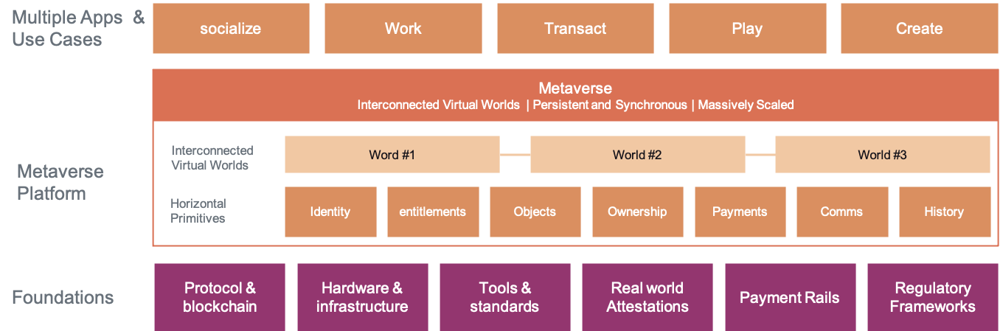

# Coinbase Metaverse Stack

Coinbase [internal presentation](https://www.coinbase.com/blog/how-coinbase-thinks-about-the-metaverse) about the Metaverse:

> While the full Metaverse is years away, it will rest on a foundation that’s being built right now. 

>Like the internet today, the Metaverse will rely on hardware and infrastructure, tools and standards, and regulatory frameworks — most of which haven’t been fully developed yet.

> But unlike today’s internet, there won’t just be one Metaverse. There will be many Metaverses, and they’ll be interconnected. That’s why it will be important for any Metaverse to be trustless — meaning people can interact directly without going through an intermediary — and permissionless — meaning anyone can participate without authorization from a governing body.

> To achieve this, the Metaverse will rely on blockchain to transfer identity and ownership across virtual worlds, attestation to verify them, and payment rails that allow people buy, sell, and earn income within a decentralized economy.