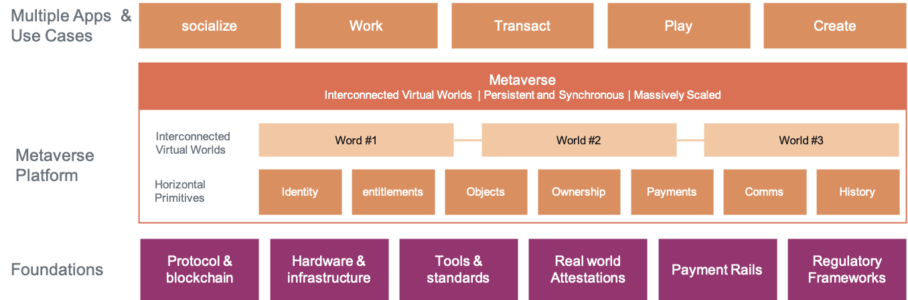

# Community-Driven Technical Capability Framework

At Protocol Labs, we build protocols, tools, and services to improve the internet ([IPFS](http://ipfs.io/), [Filecoin](http://filecoin.io/), [libp2p](https://libp2p.io/), [nft.storage](http://nft.storage/) et al.). Our mission and our work in driving [NFT infrastructure, mainly storage](https://nft.storage/stats/) guided us naturally to explore the next evolution of the web — the Metaverse. Last year, we started a [team to focus on the Metaverse](http://metaverse.filecoin.io/). We set out to develop a perspective on how we can help drive the upward trajectory of the space. In line with our core values, we very much believe that the Metaverse should be open and interoperable. We detail some of our thoughts drawn from several discussions below.

> While the full Metaverse is years away, it will rest on a foundation that’s being built right now. 

>Like the internet today, the Metaverse will rely on hardware and infrastructure, tools and standards, and regulatory frameworks — most of which haven’t been fully developed yet.

> But unlike today’s internet, there won’t just be one Metaverse. There will be many Metaverses, and they’ll be interconnected. That’s why it will be important for any Metaverse to be trustless — meaning people can interact directly without going through an intermediary — and permissionless — meaning anyone can participate without authorization from a governing body.

> To achieve this, the Metaverse will rely on blockchain to transfer identity and ownership across virtual worlds, attestation to verify them, and payment rails that allow people buy, sell, and earn income within a decentralized economy.

### The Filecoin Stack

The Filecoin stack allows storage and retrieval of the most important data. It is a set of modular components to build an open, composable Metaverse. The modularity provides flexibility for teams to pick and choose the components they need.

* NFT.storage is designed for NFT developers who want free, multi-generational, decentralized storage on IPFS and Filecoin.https://nft.storage/
* Web3.Storage is a general-purpose Filecoin & IPFS storage service with familiar and simple interfaces offering production-level storage and retrieval that is reliable and performant. https://web3.storage/
* Estuary is an open source software that allows the easy sending of public data to the Filecoin network, which can be retrieved from anywhere. http://estuary.tech/
* Filecoin, built on top of IPFS, is the world’s *largest* distributed storage network powered by robust crypto-economic incentives, and enforced via zero knowledge proofs. Filecoin guarantees data persistence, and complements IPFS. https://filecoin.io/
* IPFS is a distributed system for storing and accessing files, data assets, applications, and data. IPFS knows how to find what you ask for, by using its content address rather than its location - regardless of where the content is stored. Ideal for quick and secure data retrieval. https://ipfs.io/
* IPLD: A data model of the content-addressable web - allowing us to treat all hash-linked data structures as subsets of a unified information space. IPLD enables verifiable linking, regardless of where content ultimately resides. It is a core building block for an interoperable Metaverse.https://ipld.io/
* Libp2p: A modular system of *protocols, specifications, and libraries* that enable the development of peer-to-peer network applications. Trusted by [Polkadot](https://www.parity.io/blog/why-libp2p) and [Ethereum 2.0](https://github.com/ethereum/consensus-specs/blob/dev/specs/phase0/p2p-interface.md#why-are-we-overriding-the-default-libp2p-pubsub-message-id). https://libp2p.io/

## Immortalize your data on Filecoin

Many technologies across three layers: experiences, user capabilities, and infrastructure - are required to build the Metaverse.

