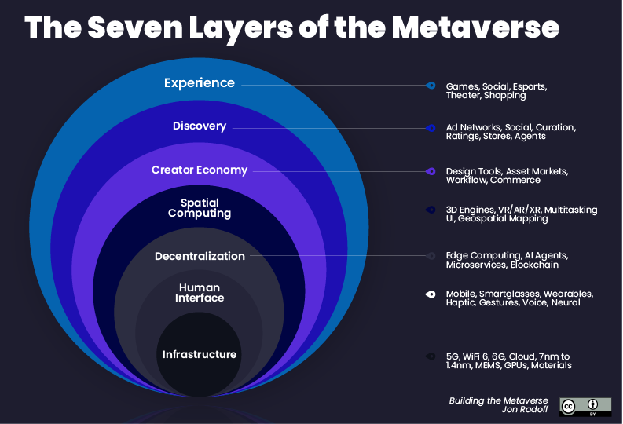

# Introduction

There are some good frameworks and models that exist today to describe the Metaverse. Here are some that we like and have guided our thinking: [OV Open Metaverse OS](https://outlierventures.io/research/the-open-metaverse-os/), [Coinbase Metaverse Stack](https://blog.coinbase.com/how-coinbase-thinks-about-the-metaverse-16d8070f4841), [Matthew Ball’s Metaverse Primer](https://www.matthewball.vc/all/forwardtothemetaverseprimer), or [our community-driven technical capability framework](https://mscape.io/)).

https://www.matthewball.vc/all/forwardtothemetaverseprimer

https://medium.com/building-the-metaverse/the-metaverse-value-chain-afcf9e09e3a7

https://medium.com/@web3scout/decentralized-metaverse-architecture-ed360bb5d7d9

https://medium.com/building-the-metaverse/market-map-of-the-metaverse-8ae0cde89696

https://medium.com/building-the-metaverse/the-metaverse-canon-reading-guide-9eb1b371b505