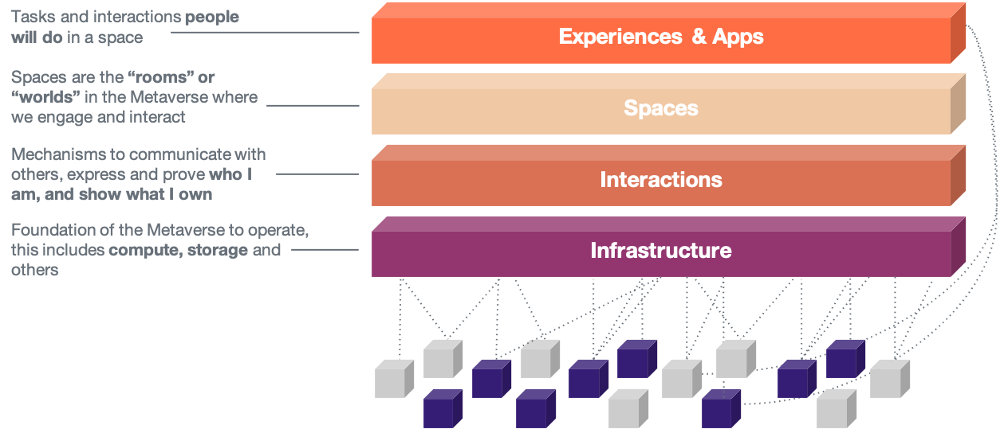
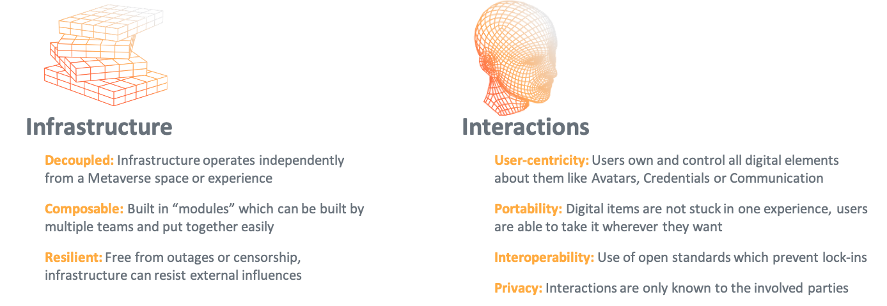
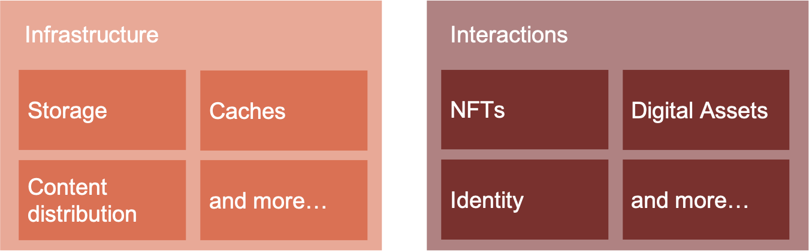
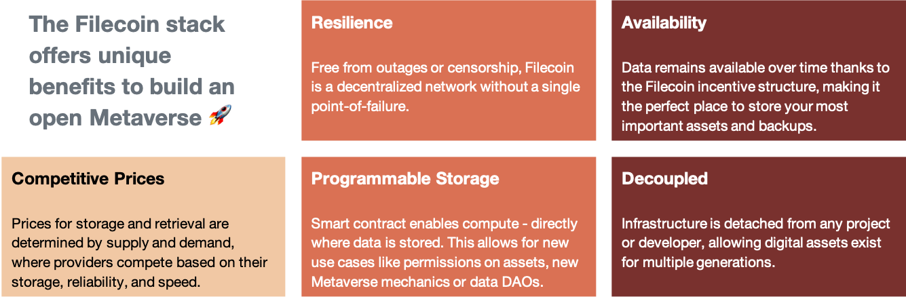

# Protocol Labs Metaverse Stack

At Protocol Labs, we build protocols, tools, and services to improve the internet ([IPFS](http://ipfs.io/), [Filecoin](http://filecoin.io/), [libp2p](https://libp2p.io/), [nft.storage](http://nft.storage/) et al.). Our mission and our work in driving [NFT infrastructure, mainly storage](https://nft.storage/stats/) guided us naturally to explore the next evolution of the web — the Metaverse. Last year, we started a [team to focus on the Metaverse](http://metaverse.filecoin.io/). We set out to develop a perspective on how we can help drive the upward trajectory of the space. In line with our core values, we very much believe that the Metaverse should be open and interoperable. We detail some of our thoughts drawn from several discussions below.

## Essential infrastructure to power the Metaverse

The Filecoin stack is open and resilient, built to store assets for multiple generations

We suggest a simple model with four interconnected layers to describe the elements required for the Metaverse, which is the way we like to talk about it at Protocol Labs.

### Infrastructure for the Metaverse

The Metaverse is the next evolution of the web which will be comprised of interconnected digital spaces in which humans interact with a sense of presence and will have experiences and use applications.

We believe it has to be an open, composable stack and run on a massively scaled, resilient, and interoperable infrastructure which has to enable real-time interactions.

Four interconnected layers are required for the Metaverse.

### The Four Layers of the Metaverse

The infrastructure layer is the foundation of the Metaverse. It consists of compute, storage and other core components like networking.

To actively engage with others, interactions are required. The ability to own and control an identity, to prove who I am (e.g. credentials), express myself (e.g. Avatars), show what I own (e.g. profile), transact with others (e.g. wallet), and communicate with others (voice, chat) is important. User control is critical to this layer. For more on this topic, see a previous article we published, on [The Role of Identity in Connecting the Metaverse](https://medium.com/allthingsweb-blog/the-role-of-identity-in-connecting-the-metaverse-1a3d89323025))

Spaces are built on top of interaction and the underlying infrastructure where we can engage and interact with each other. It is a place to be. Spaces can be 2D or 3D and rendered on a screen, VR and or AR headset.

On top of spaces and interactions layer, creators will build experiences for people to enjoy and applications that help to fulfil tasks. These things will be the activities of the Metaverse like gaming, social interactions, or work.

## The importance of Infrastructure & Interactions

### Infrastructure and Interaction is crucial for the open Metaverse

The Infrastructure and Interactions layers (we call them I²) are important. While spaces and experiences may remain discrete or gated (some may say “closed”), what’s perhaps more important is that one can *interact freely* from space to space, and developers can *build a variety of spaces and applications freely*. A parallel in the physical world would be this: while I may not be able to enter each venue that exists on this planet (“space”), I can bring my cloth, identity, backpack, etc. (“digital assets”) wherever I go. If I wish to create an event (“experience”), such as holding my 21st birthday party, I have easy, composable tools to do so. If we can do all this without relying on central intermediaries, we will ensure user empowerment in the Metaverse, just like we would expect in the physical world.

How we as a community shape I² will determine the future.

### Principles of Infrastructure & Interaction

**Infrastructure**, as the foundation, should be guided by the following principles:
- **Decoupled**: Infrastructure operates independently from a Metaverse space or experience
- **Composable**: Infrastructure components, such as Shared Compute, Storage, Caching, and Interfaces, should be built in “modules” which can be built by multiple teams and put together easily. This is opposed to the strong monopolistic platform model established by Web2
- **Resilient:** Free from outages or censorship, infrastructure can resist external influences

It is crucial to remember that while Infrastructure is “invisible” to the end-user, *how* something is built makes a lot of difference in the long run. For instance, if a developer decides to shut down its services user achievements, digital items, social contacts etc., are gone. This happened recently when [Ubisoft announced to stop the online services for 90 games](https://www.gamespot.com/articles/ubisoft-shuts-down-online-services-for-90-older-games/1100-6502780/). If digital items are stored independently from a project (e.g. using IPFS/ Filecoin), this simply couldn’t happen.

Secondly, here are some principles we think are relevant for the **Interactions** layer:

- **User-centricity**: Users own and control all digital elements about them like Avatars, Credentials or Communication
- **Portability**: Digital items are not stuck in one experience, users are able to take it wherever they want
- **Interoperable Interactions**: Interactions are built on open standards which enable interoperability and prevent lock-ins
- **Privacy**: Interactions are only known to the involved parties

## Use cases for IPFS & Filecoin in the Metaverse

Protocol Labs has the mission to drive breakthroughs in computing to push humanity forward. Already today, different protocols, infrastructure and tools exist that power the decentralised web:

- [**IPFS**](https://ipfs.io/) is a distributed system for storing and accessing files, data assets, applications, and data. IPFS knows how to find what you ask for, by using its content address rather than its location — regardless of where the content is stored.
- [**Filecoin**](https://filecoin.io/), built on top of IPFS, is the world’s largest distributed storage network powered by robust crypto-economic incentives and enforced via zero-knowledge proofs. Filecoin guarantees data persistence and complements IPFS. The Filecoin network is powered by Storage Providers around the world. This global infrastructure will help to support the future needs of the Metaverse.
- [**Libp2p**](https://libp2p.io/) is a modular system of protocols, specifications, and libraries that enable the development of peer-to-peer network applications. It is used across web3, for example, by [Polkadot](https://www.parity.io/blog/why-libp2p) and [Ethereum 2.0](https://github.com/ethereum/consensus-specs/blob/dev/specs/phase0/p2p-interface.md#why-are-we-overriding-the-default-libp2p-pubsub-message-id).

IPFS and Filecoin can be used today in the infrastructure and interaction layer, a few use cases are shown below:

### The Filecoin stack offers unique benefits to build an open Metaverse

**Resilience**

Free from outages or censorship, Filecoin is a decentralized network without a single point-of-failure.

**Availability**

Data remains available over time thanks to the Filecoin incentive structure, making it the perfect place to store your most important assets and backups.

**Competitive Prices**

Prices for storage and retrieval are determined by supply and demand, where providers compete based on their storage, reliability, and speed.

**Programmable Storage**

Smart contract enables compute - directly where data is stored. This allows for new use cases like permissions on assets, new Metaverse mechanics or data DAOs.

**Decoupled**

Infrastructure is detached from any project or developer, allowing digital assets exist for multiple generations.

## Further Reading

[How we think about the Metaverse | All Things Web](https://medium.com/allthingsweb-blog/how-we-think-about-the-metaverse-374085b9e90)

[Talk: Building the Metaverse with IPFS at BuildQuest Summit 2022 | by Jonas Jetschni | All Things Web | Medium](https://medium.com/allthingsweb-blog/talk-building-the-metaverse-with-ipfs-at-buildquest-summit-55536f7e3dd)
