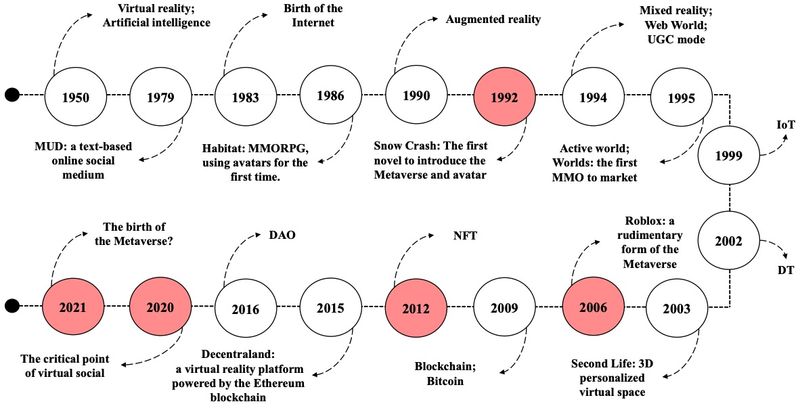

### Introduction

Metaverse has become ae buzzword in the tech industry. Not a single day goes by without a mention of it in the media, especially around investments, startups building components, new platforms being announced and large companies entering this world of digital engagement. There is undeniably a huge momentum of an almost real 3D virtual world, and the clarion call was perhaps Facebook rebranding itself as Meta which will perhaps be remembered as a red letter moment in the evolution of the Metaverse.

While the Metaverse can seem like a fairly new concept, the origin of Metaverse dates back to 1992 when Neal Stephenson coined the term in his science-fiction novel “Snow Crash” and early glimpses of it showed up a decade back from Roblox. For very obvious reasons, the reactions in the market were mixed. For instance, Fortnite, developed by Epic Games, started out as a successful 4-player game but soon ended up becoming one of the coolest online hangouts for Gen-Z. The resultant hype caused it to pivot towards becoming a social platform that recently hosted virtual concerts of Ariana Grande and Travis Scott, not surprisingly, attended by millions of music lovers in virtual avatars. 

Metaverse can be best described as persistent, connected virtual realities where people work, play, and socialize: anytime, anywhere, and from any device. It is the convergence of the physical, augmented, and virtual reality where users can interact with each other in real-time scenarios. It’s a revolutionary form of digital interaction with endless, untapped potential that holds massive opportunities in the marketplace. 

This immersive virtual world that Metaverse aims to bring to us will not just be limited to user engagement but can be envisaged as an extension of the real world where organizations and people come together to invest, build, and trade products and services. It is the next-generation internet that will transport us to an immersive and hyper-realistic digital world. 

While the concept is not fully evolved yet, it is certain that new-age technologies such as AR/VR/MR, IoT, AI, 5G and Blockchain will become an enabling force to create a full-blown interconnected virtual world. It is no wonder that companies around the globe have placed big bets on it. 

### The timeline of the Metaverse 

#### Incubation

In 1979, the first Multi-User Dungeon (MUD) appeared. It uses a text interface to connect multiple users together in real time, forming an open social and cooperative world. In 1986, Habitat, the world’s first MUD online game with a 2D graphical interface, was launched. It is considered the forerunner of modern massively multiplayer online role-playing games (MMORPGs), allowing humans to enter virtual worlds for the first time using avatars. In 1984, Canadian writer William Ford Gibson coined the word "cyberspace" in his science fiction novel Neuromancer, which also gave rise to the "cyberpunk" culture. The novel depicts the rich virtual space behind the computer screen, giving people an advanced look into the digital world of the future. The concept of "Metaverse" and "avatar" was first explicitly introduced in 1992 by Neil Stephenson in his novel Snow Crash. In the novel, a real human and a virtual human live together in a virtual space through VR equipment, showing the space-time extension and man-machine symbiosis of the Metaverse. The Metaverse has been on the scene ever since. 

#### Preparation

The most likely starting point for the Metaverse implementation is the gaming sector. In 1994, Web World, the first multiplayer social game with an axonometric interface, was introduced. In this game, users can socialize in real time and transform the game world. The user generated content (UGC) mode was enabled. In 1995, Worlds Inc. became the first massively multiplayer online game (MMOG or more commonly MMO) to market, hoping that users could conduct open social interactions in 3D space. In 1995, based on the novel Snow Crash, Active Worlds was created. Active Worlds provides users with basic content creation tools to personalize 3D virtual environments. In 2003, Linden Laboratory in the United States developed the phenomenallevel virtual world "Second Life", which has powerful world editing functions. Unlike previous digital games, this game has a virtual economy that generates value in the real world and can be used in areas such as education. Therefore, a large number of enterprises and institutions were attracted. In 2006, the multiplayer online creation game Roblox was officially released. With a rudimentary version of the Metaverse, the majority of the works in the game are user-created, interactive, and linked to real life. Due to the COVID-19 pandemic, people’s social lives are gradually moving online. The rapid growth of the demand for online interaction accelerates the maturity of emerging technologies such as XR, digital twins, and blockchain. The development of the Metaverse has entered the early stages of explosion. 

#### Rise period

2021 is considered likely to be the first year of the Metaverse. Roblox went public in March 2021 with the title of "the first stock of the Metaverse", which triggered a heated discussion about the Metaverse. In May 2021, the Google I/O conference announced a 3D video calling technology called Starline. In October 2021, Facebook changed its corporate name to Meta, taking the prefix from the Metaverse, officially starting a comprehensive transformation from a social media platform to the Metaverse ecosystem. In November 2021, numerous companies began to turn their attention to the Metaverse. Microsoft announced at the Ignite conference that it has officially entered the Metaverse field and will launch Mesh for Microsoft Teams software to assist in office work. NVIDIA launched Omniverse, a platform for generating interactive AI avatars. It can help creators build virtual characters in the Metaverse. Disney will take the Metaverse as its future development direction and build a supporting IP image. In January 2022, Microsoft acquired Activision Blizzard, the world’s largest game developer and publisher, for $68.7 billion. So far, the development of the Metaverse has entered a stage of rapid development.

The detailed timeline of the Metaverse is shown in Fig. blew.

### 5 Thecnologies Shaping the Metaverse

Recent technology advancements and the emergence of the tech-savvy Gen Z is expected to speed up the adoption of the Metaverse. Factors that are significantly contributing to this growing trend are:

* Pandemic and the shift to hybrid work arrangements
* Consumerization of AR/VR headsets
* High-Speed networks Advances in AI, IoT, and Cloud Infrastructure
* Shift in customer preferences towards digital asset investments and virtual experiences
* Evolution of Web 3.0

### 9 Megatrends Shaping the Metaverse

Jon Radoff, founder of Beamable, has identified 9 [megatrends](https://en.wikipedia.org/wiki/Megatrend) — exponential shifts that are already underway on a global scale — and how they will shape the future of the metaverse. Most of the megatrends are a blend of both **technology** and **social change**.

* Virtual Mainstreaming
* Low-code Platforms
* Machine Intelligence
* Rise of Cybernetics
* Challenges by Open Systems
* Blockchain Adoption
* Walled Garden Ecosystems
* Accelerating Distributed Networks
* Simulating Reality

### Development Stages of Metaverse

At Deloitte we see the development of the metaverse through four stages: infancy stage, early stage, mature stage and final stage. Currently, a variety of digital and intelligent concepts have appeared in the industry, which can be regarded as the infancy of metaverse. The next 5-10 years are expected to witness the early development of the metaverse as the relevant technologies mature and the concept of the metaverse strengthens.

* The infancy stage is from 2016 to 2020. Although the concept of metaverse did not appear, different industries were carrying out technological singlepoint trials for digitalization or virtualisation.
* The early development stage is from 2021 to 2030. This stage involves further online, digital and virtual applications and technological advancements in different industries, eventually forming a single-scenario based on independent metaverses and small decentralized, single-industry, multi-centered ecosystems of the metaverse. Technological patterns, platform infrastructure and key connecting devices, such as XR devices, will be primarily developed in this stage. Looking at application developments, the focus will be on the applications in hot industries.
* The mature stage starts from 2031, during which the independent metaverses of different industries gradually share data and form unified standards, and achieve integration. Deloitte believes that in this stage, there will be cross-platform and crossindustry ecological connection and integration—the small decentralized, multi-center ecosystems will integrate to gradually form two metaverse ecosystems respectively centering on industries and individuals. Deloitte believes that unified data standards, payment systems and identity authentication are the key to achieving cross-platform development and integration at this stage.

TODO:

The Case for the Metaverse

Web1 brought us online, Web2 allowed online communities to flourish, Web3 is allowing communities to own and build the platforms. We can think of this paradigm shift as the emergence of crypto cloud economies with the metaverse as the central part of that trend.
https://events.bizzabo.com/filaustin/agenda/session/903534

Metaverse: Survey, Applications, Security, and Opportunities
https://arxiv.org/pdf/2210.07990.pdf

