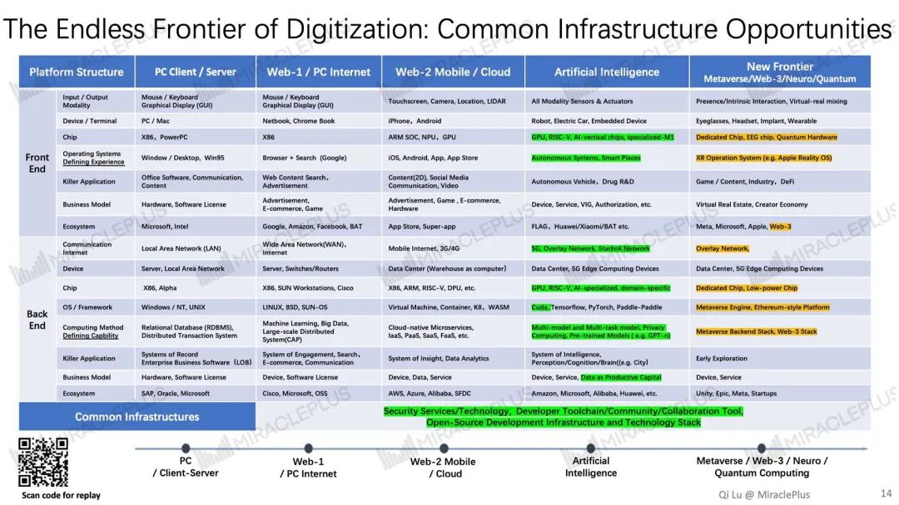

## 28 slides explaining 11 frontiers of tech-driven innovation

On 26th June, Dr. Qi Lu made his online webinars with the participants from North America and Europe. In this article, you can click on and enlarge these slides to gain a better understanding of how Dr. Qi Lu interprets the new environment and opportunities of today, including tech-driven innovation and entrepreneurship in all 11 sectors. 

You may find out more details about Mobile/Cloud, Artificial Intelligence, Metaverse, Web3, Neuro, Quantum, New Energy Technology, New Life Science, New Material Science, New Aerospace Science and Sustainable Development (ESG), and learn about our unique investment + acceleration model at MiraclePlus.

A Chinese transcript of a similar talk will be available in about 2 weeks. Scan the code (the header) to join our founders' community to view the full video. We look forward to meeting you there!

